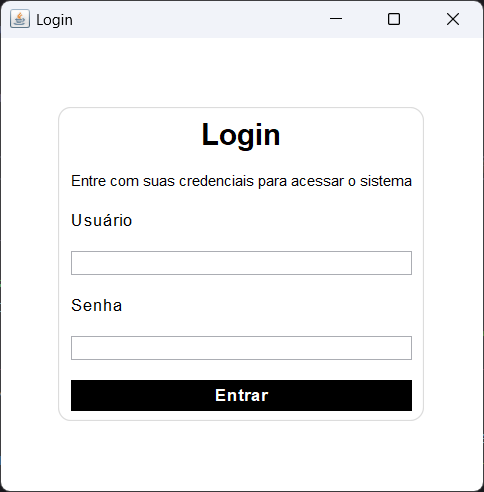
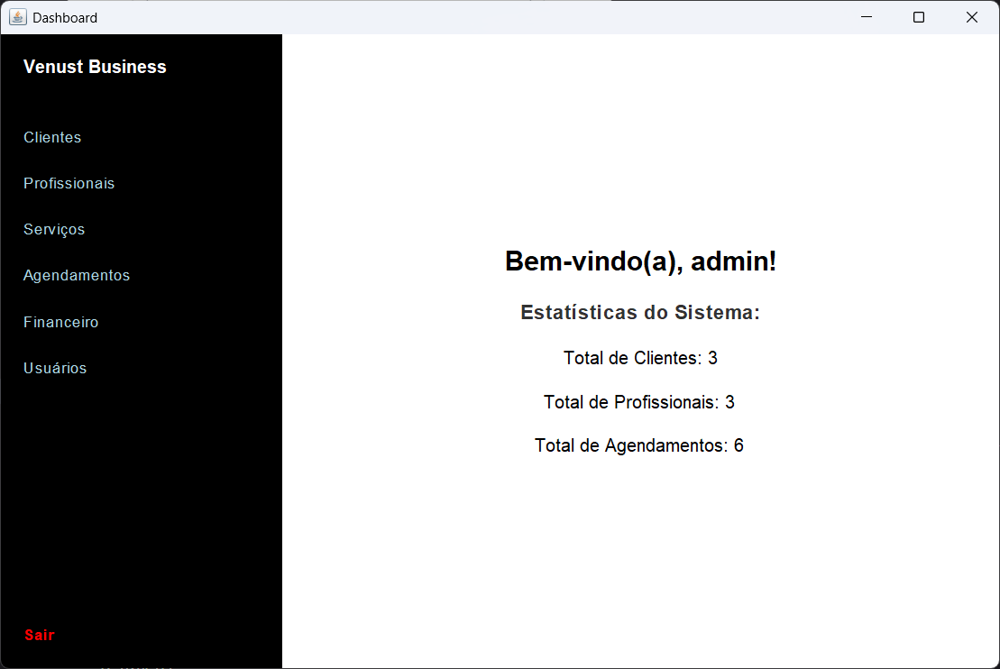
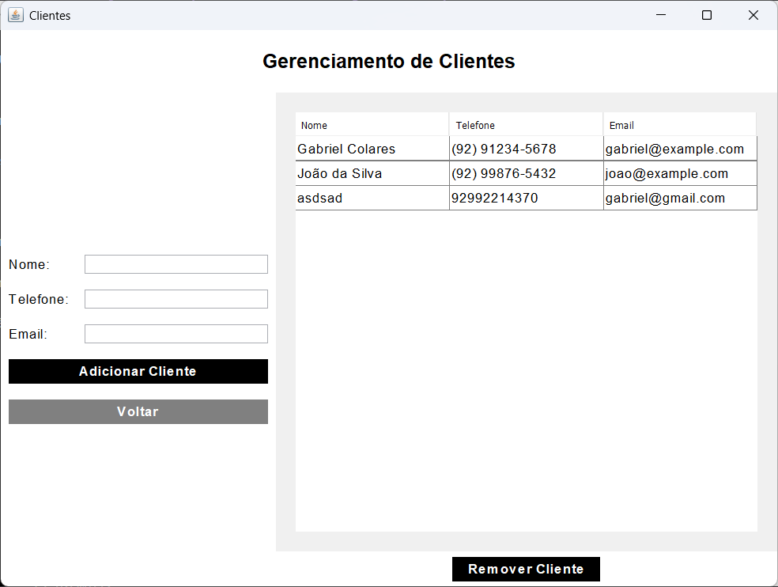
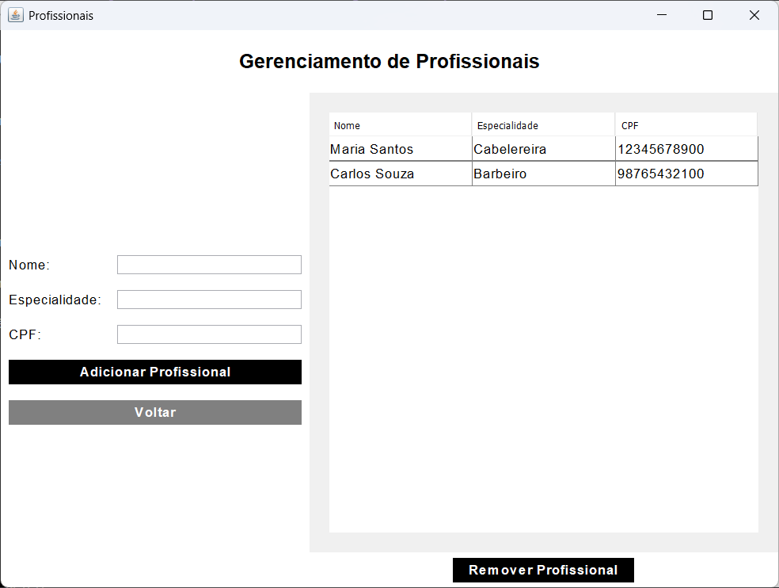
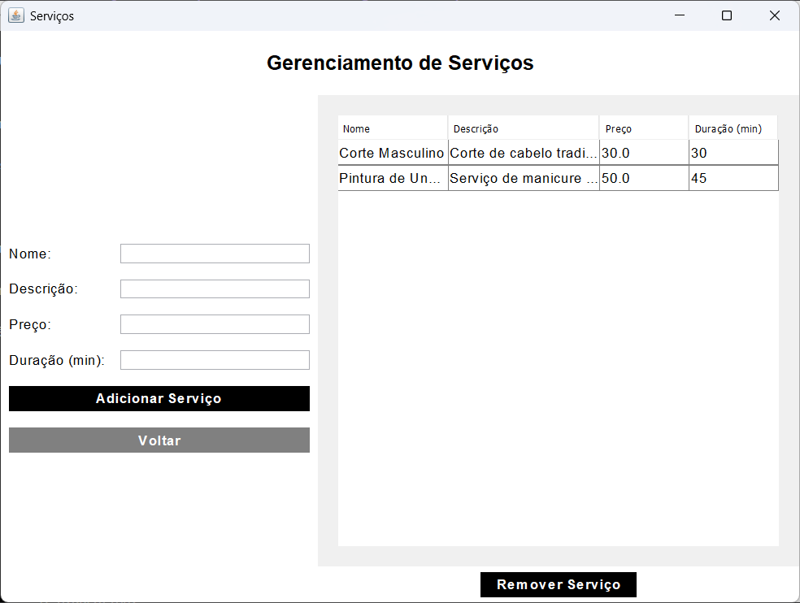
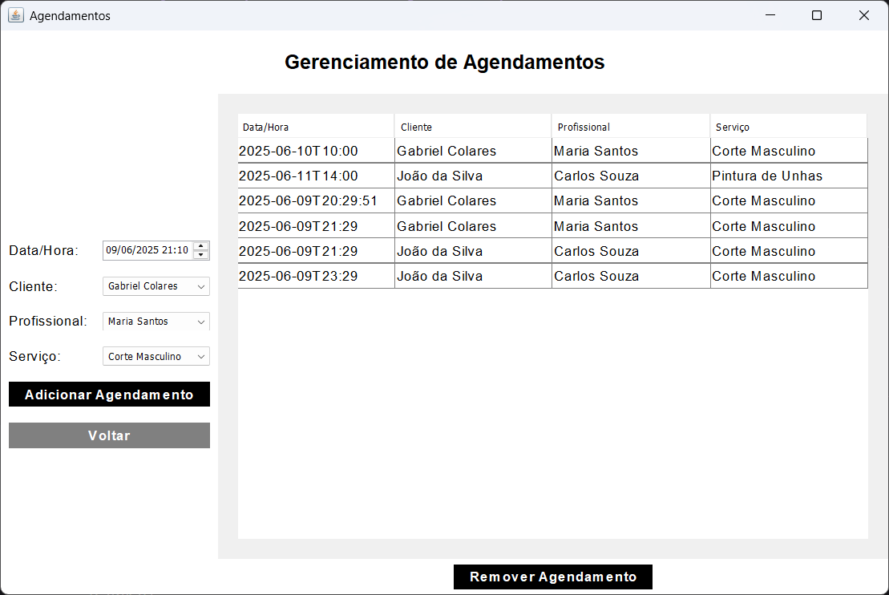
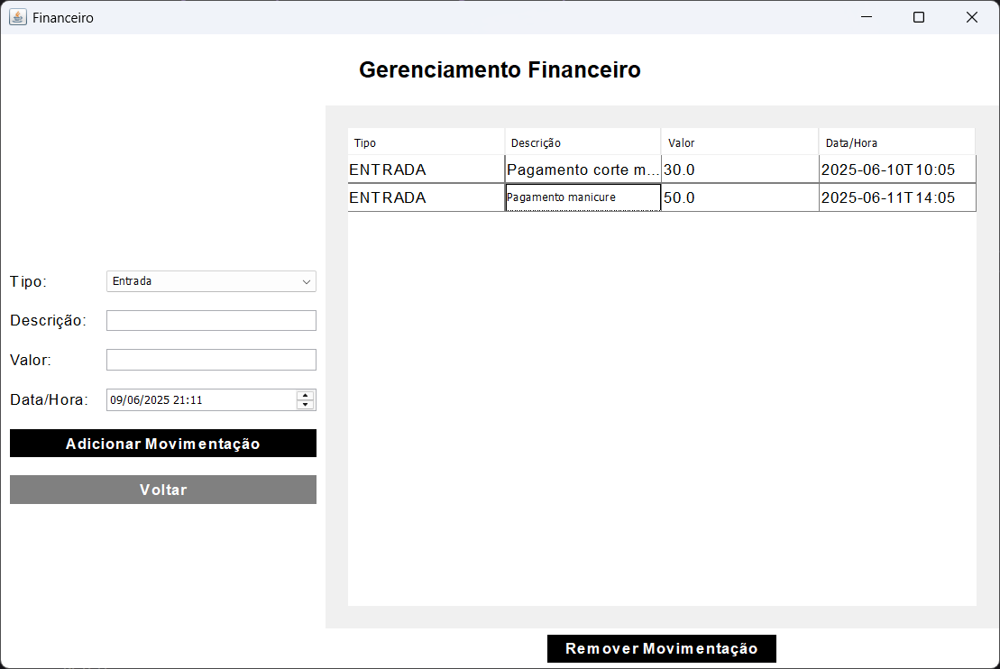

# 💇‍♂️💅 Projeto Desktop Java — Sistema de Agendamentos para Salão de Beleza

## 📌 Status do Projeto
🚧 Em desenvolvimento

## 🛠️ Tecnologias Utilizadas
- Java SE
- Java Swing (GUI)
- Hibernate/JPA
- MySQL
- Git e GitHub

## 👥 Time de Desenvolvedores
- Gabriel Colares

## 🎯 Objetivo do Software
O projeto tem como objetivo oferecer um sistema desktop eficiente para a gestão de agendamentos em salões de beleza e barbearias. O software facilita o controle de clientes, profissionais, serviços e agenda de horários, oferecendo uma interface amigável para o usuário final.

## ✅ Funcionalidades Principais
- **Tela de Login**: Autenticação de usuário.
- **Cadastro de Clientes**: Permite registrar e gerenciar clientes com informações de contato.
- **Cadastro de Profissionais**: Cadastro de cabeleireiros, barbeiros e outros profissionais.
- **Cadastro de Serviços**: Gerenciamento de serviços oferecidos, incluindo preço e duração.
- **Agendamento de Horários**: Interface intuitiva para criação, edição e remoção de agendamentos, evitando conflitos de horários.
- **Controle Financeiro (Caixa)**: Lançamento de entradas e saídas de caixa.
- **Prevenção de Conflitos**: Checagem de horários sobrepostos para o mesmo profissional.
- **Integração com Banco de Dados MySQL**: Dados persistidos de forma segura.
- **Interface Moderna com Java Swing**: Interface de usuário clara, moderna e responsiva.

## 🖼️ Telas do Sistema

O sistema conta com diversas telas que tornam a navegação intuitiva e moderna. Seguem os mockups e descrições:

### [Evidência imagem: Tela de Login]

- Permite ao usuário acessar o sistema com suas credenciais.

### [Evidência imagem: Menu Principal]

- Acesso às principais funcionalidades: clientes, profissionais, serviços, agendamentos, caixa e relatórios.

### [Evidência imagem: Gerenciamento de Clientes]

- Cadastro, edição e remoção de clientes.

### [Evidência imagem: Gerenciamento de Profissionais]

- Cadastro de profissionais e especialidades.

### [Evidência imagem: Gerenciamento de Serviços]

- Cadastro de serviços com descrição, preço e duração.

### [Evidência imagem: Gerenciamento de Agendamentos]

- Tela completa para visualização e criação de agendamentos, com prevenção de conflitos de horário.

### [Evidência imagem: Controle Financeiro]

- Lançamentos de entradas e saídas de caixa com histórico.

## 📌 Observações Finais
Este projeto integra as competências da disciplina de **Gerenciar a configuração e versionamento de software**, aplicando as melhores práticas de versionamento com Git e GitHub.